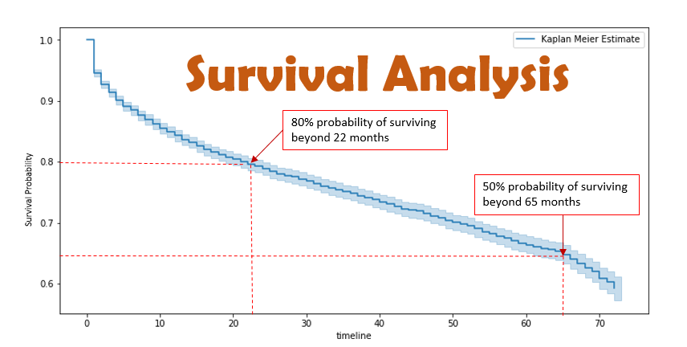
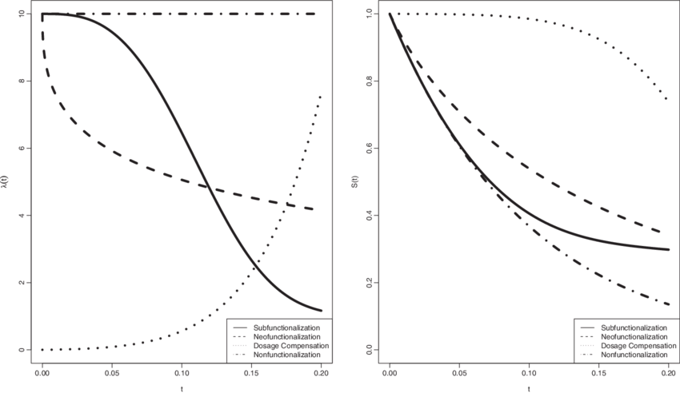

# **Survival-Analysis**
       “A single death is a tragedy; a million deaths is a statistic.”
                                                                            _______ Joseph Stalin
### You can find "Time Series Analysis"  [here](https://github.com/mahendranandi/NIFTY-Share-Market-Price-Prediction)

 Readme file for this repo is in progress, will be uploaded soon.

# Content:
- `[a] Introduction `
- `[b] What is Survival Analysis`
- `[c] Practical Applications of Survival Analysis`
- `[d] Difference from Linear Regression analysis`
- `[e] Prerequisite`
    - `[a] Sencoring`
    - `[b] Trancation`
    - `[c] Survival Function`
    - `[d] Hazard Function`
    - `[e] Cumulative Hazard Function`

- `[f] Survival Models`
    - `[a] Non-parametric model: Kaplan-Meier curve`
    - `[b] The log-rank test`
    - `[c] Semi-parametric model: Cox proportional hazards regression`
    - `[d] Parametric models`
- `[g] About Dataset`
    - `[a] Feature description`
    - `[b] Summary statistics`
- `[p] References`

Currently this page is under correction. Please follow this page till then [here](https://sphweb.bumc.bu.edu/otlt/mph-modules/bs/bs704_survival/BS704_Survival_print.html)

<!-- 
###

# `[a] Introduction `
Suppose data contains two kinds of loan information: Good and Bad \
A binary question: Can I say, whether the loan is good or bad,
considering the customer profile\
Answer: Yes, by standard classification techniques (e.g. logistic
regression, random forest, etc.)
Question: When would the loan go bad?\
Question: Between two banks which one is possessing riskier loans? \
No answer by classification method. Answer is given by Survival Analysis

We model the time to failure [T ] data (or time-to-event data or
survival data)
- Time from medication to relapse of leukemia such as 
When the leukemia will returned for a patient? 
- Time from date of breast cancer detection to death of patient such as 
When the patient will die? 
- Time from date of admission to death of patient such as 
When the patient will die? 
- Time from loan approved to loan default such as 
When the customer will be defaulter?

----------------------------------------------------------------------------------------------------------------------------------------------------

------------------------------------------------------------------------------------------------------------------------------------------------------
# Survival Analysis: 
## Introduction: 
       The random variable of most interest in survival analysis is time-to-event.
 Often in biomedical studies, the event is death. It is because of this common application the field is termed
Survival Analysis. Survival analysis methods can be applied to a wide range of data not just biomedical
survival data. Other time-to-event data can include: time-to-relapse of a disease, length of stay in a
hospital, duration of a strike, money paid by insurance company, time-to-employment (Klein), failure
times of electrical components, etc. (Survival).

There is generally a relatively short window for the duration of any study where the event is observed to
occur or not occur. When the duration of study is small, adjustments must be made to account for
`potential biases`. Useful data will be excluded when data is `censored` but not accounted for, and biases
can be introduced when data is `truncated`. Since censoring and truncation are often confused, a brief
discussion on censoring with examples is helpful to more fully understand __`left-truncation`__.
There are three general types of censoring, `right-censoring`, `left-censoring`, and `interval-censoring`. The
most common type of censoring encountered in survival analysis data is `right censored (Survival)`. We adjusted our model for the herpes data to account for right censoring. It is called right censoring because the true unobserved event is to the right of the censoring time. Left-censoring occurs
when we cannot observe the time when the event occurred. __For obvious reasons if the event is death,
the data can’t be left-censored__. A good example is discussed in an ASA paper on survival analysis, “e.g.
[a] study of age at which African children learn a task. Some already knew (left-censored), some learned
during a study (exact), some had not yet learned by end of study (right-censored).” Interval-censoring is
also discussed in Survival Analysis: Introduction (Survival).
__`Truncation`__ is due to sampling bias that only those individuals whose lifetimes lie within a certain interval
can be observed. To further discuss left-truncation we will use the motivating example. A useful insight and directly applicable to the motivating example, “Age is often used as a covariate when it should be used as a left-truncation point. When age is used as a left-truncation point,
it is unnecessary to use it as a covariate in the model” (Klein).

__Motivating Example:__ Survival data on 26 psychiatric inpatients admitted to the University of Iowa
hospitals during the years 1935–1948. This sample is part of a larger study of psychiatric inpatients
discussed by Tsuang and Woolson (1977). Data for each patient consists of age at first admission to the
hospital, sex, number of years of follow-up (years from admission to death or censoring) and patient
status at the follow-up time. Ultimately we want to know if male psychiatric patients and female
psychiatric patients are more likely to die than the general public. The data from the hospitals are
displayed in the table below (Klein).

The way we coded the variable death, death(0) indicates censoring time. It is important to adjust for
left-truncation in this data because patients entered into the study (admitted to the hospital) have not
died. This fact could bias the results, when results are compared to the general population of Iowa
residents. It is stratified by sex because many studies show women live longer than men so we want to
compare by gender.

------------------------------------------------------------------------------------------------------------------------------------------------------

------------------------------------------------------------------------------------------------------------------------------------------------------

One must take care in interpreting these statistics. For example, the
Product-Limit estimator of the survival function at a time t is now an
estimator of the probability of survival beyond t, conditional on survival
to the smallest of the entry times L, $Pr [X ⬎ t | X ⱖ L] ⫽ S (t) S (L)$.
Similarly the Nelson–Aalen statistic estimates the integral of the hazard
rate over the interval L to t. Note that the slope of the Nelson–Aalen
estimator still provides an estimator of the unconditional hazard rate.
Some care in directly applying these estimators is needed. For left-
truncated data, it is possible for the number at risk to be quite small
for small values of $t_i$ . If, for some $t_i$ , $Y_i$ and $d_i$ are equal, then, the
Product-Limit estimator will be zero for all t beyond this point, even
though we are observing survivors and deaths beyond this point. In
such cases, it is common to estimate the survival function conditional
on survival to a time where this will not happen by considering only
those death times beyond this point. This is illustrated in the following
example.

------------------------------------------------------------------------------------------------------------------------------------------------------

1

# `[a] What is Survival Analysis`

A survival model is used to analyze time-to-event historical data and to generate estimates, referred to as survival curves, that show how the probability of the event occurring changes over time. In many life situations, as time progresses, certain events are more likely to occur. The survival models help decision makers to form better estimates than guessing about the expected timing of certain events. The estimates take into account the impact of other variables, referred to as independent, predictor variables or covariates, on the expected timing of the event to occur. A survival analysis can be used to determine not only the probability of failure of manufacturing equipment based on the hours of operations, but also to differentiate between different operating conditions. For example, if the probability changes if the machine is used outdoors versus indoors.

What is Survival Analysis?
Survival Analysis is a modelling technique used to model time to an event ie. it is used to know how long will it take for an event to occur. The events could be time to death after a heart attack, time to get a job after graduation, the time till which a couple stays married or time till which a machine works properly, etc.
Survival Analysis consists of three parts:
Collecting and processing survival data
Choosing a survival function
Performing analysis via different methods

# `[c]Practical Applications of Survival Analysis`
Survival analysis is used for:
Engineering. It is used to perform reliability or failure analysis on parts and components.
Warranty Applications. It is used to estimate optimal time for part replacement versus part service.
Healthcare. It is used to estimate the risk of disease progression in patients, the impact of medications and treatment algorithms, and the timing of medications and procedures.
Government and Social Services. It is used in child welfare to match children with foster parents and to optimize the length of stay of children in the program, to estimate participation time in various social programs, and to estimate the time it takes for various policies to take effect.
Law Enforcement. It is used to estimate the likelihood of recidivism.
Marketing Operations. It is used to assess the length of participation in loyalty programs.

# `[d] Difference from Linear Regression analysis`:
If survival analysis is so much like regression, why use a different modeling technique? Why not use linear regression?

Survival analysis methods are explicitly designed to deal with data about terminal events where some of the observations can experience the event and others may not. Such observations are called censored observations. For example, the target variable represents the time to a terminal event, and the duration of the study is limited in time. Therefore, some observations will not experience the event. Some equipment will fail during the time in which we monitor performance, but some will not.

# ``[e] Prerequisite``
### `[d] Sencoring`
https://web.stanford.edu/~lutian/coursepdf/unit1.pdf

### `[d] Trancation`

### `[d] Survival Function`

#### what is Hazard function adn what is survival function:

What is a Survival Function  https://towardsdatascience.com/survival-functions-101-bd57fb8be888
It is a function which helps us to know that whether or not an object of interest is gonna survive beyond the specified time. This object of interest can be a patient, a machine or anything else.
Mathematically a survival function is denoted by S which is quite obviously a function of time. Survival function can be also interpreted as the probability that a certain object of interest will survive beyond a certain time t.
So it can be represented as:
S(t) = P(T >t)
Here T is the random lifetime which is taken from the population on which the survival analysis has to be performed and hence it is non zero
The value of the function lies between 0 and 1(inclusive) and it is a non-increasing function.
The Survival Function is sometimes also referred to as survivor function or reliability function.
The survival function S(t) can also be related to the cumulative distribution function F(t) in the following way:
S(t) = 1 - F(t)
Hence it is also called a complementary cumulative distribution function.
Types of survival functions:
Survival functions are mainly divided into two categories: parametric survival functions and non-parametric survival functions. This differentiation is based on parameters which can be mean, standard deviation, median, etc.
Let's have a look at some of the parametric survival functions:
1.Exponential survival function
In this kind of function, the probability of failure is the same in every time interval, no matter what the age of the object of interest is, so the age of the subject does not affect the probability.
2.Weibull survival function:
This function actually extends the exponential survival function to allow constant, increasing, or decreasing hazard rates where hazard rate is the measure of the propensity of an item to fail or die depending on the age it has reached.
3.Other different survival functions
We can choose other survival functions like normal, lognormal, log-logistic, and gamma depending on the data set which is under distribution. A log-logistic survival function is shown below:

### `[d] Hazard Function`
https://data.princeton.edu/wws509/notes/c7s1
7.1.2 The Hazard Function
An alternative characterization of the distribution of T is given by the hazard function, or instantaneous rate of occurrence of the event, defined as

λ(t)=limdt→0Pr{t≤T<t+dt|T≥t}dt.(7.2)
The numerator of this expression is the conditional probability that the event will occur in the interval [t,t+dt) given that it has not occurred before, and the denominator is the width of the interval. Dividing one by the other we obtain a rate of event occurrence per unit of time. Taking the limit as the width of the interval goes down to zero, we obtain an instantaneous rate of occurrence.

The conditional probability in the numerator may be written as the ratio of the joint probability that T is in the interval [t,t+dt) and T≥t (which is, of course, the same as the probability that t is in the interval), to the probability of the condition T≥t. The former may be written as f(t)dt for small dt, while the latter is S(t) by definition. Dividing by dt and passing to the limit gives the useful result

λ(t)=f(t)S(t),(7.3)
which some authors give as a definition of the hazard function. In words, the rate of occurrence of the event at duration t equals the density of events at t, divided by the probability of surviving to that duration without experiencing the event.

Note from Equation 7.1 that −f(t) is the derivative of S(t). This suggests rewriting Equation 7.3 as

λ(t)=−ddtlogS(t).
If we now integrate from 0 to t and introduce the boundary condition S(0)=1 (since the event is sure not to have occurred by duration 0), we can solve the above expression to obtain a formula for the probability of surviving to duration t as a function of the hazard at all durations up to t:

S(t)=exp{−∫t0λ(x)dx}.(7.4)
This expression should be familiar to demographers. The integral in curly brackets in this equation is called the cumulative hazard ( or cumulative risk) and is denoted

Λ(t)=∫t0λ(x)dx.(7.5)
You may think of Λ(t) as the sum of the risks you face going from duration 0 to t.

These results show that the survival and hazard functions provide alternative but equivalent characterizations of the distribution of T. Given the survival function, we can always differentiate to obtain the density and then calculate the hazard using Equation 7.3. Given the hazard, we can always integrate to obtain the cumulative hazard and then exponentiate to obtain the survival function using Equation 7.4. An example will help fix ideas.

Example: The simplest possible survival distribution is obtained by assuming a constant risk over time, so the hazard is
λ(t)=λ
for all t. The corresponding survival function is

S(t)=exp{−λt}.
This distribution is called the exponential distribution with parameter λ. The density may be obtained multiplying the survivor function by the hazard to obtain

f(t)=λexp{−λt}.
The mean turns out to be 1/λ. This distribution plays a central role in survival analysis, although it is probably too simple to be useful in applications in its own right.□

Note 1: Note that h(t)dt = f(t)dt/S(t) ≈ pr[fail in [t, t + dt) | survive until
t]. Thus, the hazard function might be of more intrinsic interest than the
p.d.f. to a patient who had survived a certain time period and wanted to
know something about their prognosis.
Note 2: There are several reasons why it is useful to introduce the quantities
h(t) and H(t):
• Interpretability: Suppose T denotes time from surgery for breast cancer
until recurrence. Then when a patient who had received surgery visits
her physician, she would be more interested in conditional probabilities
such as “Given that I haven’t had a recurrence yet, what are my chances
of having one in the next year” than in unconditional probabilities (as
described by the p.d.f.).
• Analytic Simplifications: When the data are subject to right censoring,
hazard function representations often lead to easier analyses. For example, imagine assembling a cohort of N patients who just have turned 50
years of age and then following them for 1 year. Then if d of the men
die during the year of follow-up, the ratio d/N estimates the (discrete)
hazard function of T =age at death. We will see that H(·) has nice
analytical properties.
• Modeling Simplifications: For many biomedical phenomena, T is such
that h(t) varies rather slowly in t. Thus, h(·) is well-suited for modeling.

### `[d] Cumulative Hazard Function`

-------------------------------------------------------------------------------------------------

# `[d] About Dataset`:

## `[d] Feature description`:
> Variable | Definition

> MMMM-YY | Reporting Date (Monthly)

> Emp_ID | Unique id for employees

> Age | Age of the employee

> Gender | Gender of the employee

> City | City Code of the employee

> Education_Level | Education level : Bachelor, Master or College

> Salary | Salary of the employee

> Dateofjoining | Joining date for the employee

> LastWorkingDate | Last date of working for the employee

> Joining Designation | Designation of the employee at the time of joining

> Designation | Designation of the employee at the time of reporting

>Total_Business_Value | The total business value acquired by the employee in a month (negative business indicates cancellation/refund of sold insurance policies)

>Quarterly Rating | Quarterly rating of the employee: 1,2,3,4 (higher is better)

## `[d] Summary statistics`:
## details of categorical columns:

Column Name:: gender, dtype: int64
-----------------------------
having 2 unique values

 Gender  |  Count
---------------   |   -----------
Male     | 1404
Female   |  977

Column Name:: city, dtype: int64
-----------------------------
having 29 unique values

City Name | Counts----- | City Name | Counts-----| City Name | Counts
------------ | ------------- | ------------ | -------------|------------ | -------------
C20   | 152    |    C15   | 101    |    C29   |  96     |   C26     93
C27   |  89    |    C8    |  89    |    C10   |  86     |   C16     84
C3    |  82    |    C22   |  82    |    C28   |  82     |   C12     81
C1    |  80    |    C5    |  80    |    C14   |  79     |   C21     79
C6    |  78    |    C4    |  77    |    C7    |  76     |   C9      75
C23   |  74    |    C25   |  74    |    C24   |  73     |   C19     72
C2    |  72    |    C17   |  71    |    C13   |  71     |   C18     69
C11   |  64

Column Name:: education_level, dtype: int64
-----------------------------
having 3 unique values

 education_level  |  Count
---------------   |   -----------
Master   |   802
Bachelor |   795
College  |   784

Column Name:: issurvived, dtype: int64
-----------------------------
having 2 unique values

`
0 is for observed i.e, event occured and employee left the company
and 1 for censored i.e, employee was still with the company till 2017 December
`

 issurvived  |  Count
---------------   |   -----------
0  |  1616
1  |   765

Column Name:: joining_designation, dtype: int64
----------------------------
having 5 unique values

 joining_designation  |  Count
---------------   |   -----------
1  |  1026
2  |   815
3  |   493
4  |    36
5  |    11

------------------------------------------------------------------------------------------------------------------------------------------------

# Survival Models:
https://www.theanalysisfactor.com/the-six-types-of-survival-analysis-and-challenges-in-learning-them/
### The Kaplan-Meier curve
A Kaplan-Meier curve is an estimate of survival probability at each point in time. It has very few assumptions and is a purely descriptive method. This is often your first graph in any survival analysis.

You can get confidence intervals for your Kaplan-Meier curve and these intervals are valid under a very few easily met assumptions. You can easily extract quartiles and medians (and their confidence limits) from the Kaplan-Meier curve.

The log-rank test
The log-rank test is a direct comparison of the Kaplan-Meier curves for two or more groups. You can think of it as a one-way ANOVA for survival analysis. It is easy to calculate, has very few assumptions, and for many settings, it may be the only test you need.

The only limitation of the log rank test is that it does not extend easily to more complex settings like continuous covariates and interactions.

### Cox proportional hazards regression
This is the model that most of us think of when we think Survival Analysis. It’s a pretty revolutionary model in statistics and something most data analysts should understand.

Cox proportional hazards models are unique in that they’re semi-parametric. That’s right–not entirely parametric and not entirely non-parametric. This creates a lot of flexibility, but it also creates an assumption that is so important it’s right in the name–proportional hazards.

This is a concept that is a little bit strange and takes a bit of explaining. But once you can wrap your head around it (and you know how to check it and what to do instead if it doesn’t fit), you’ll see how incredibly useful Cox models can be.

### Parametric models
Parametric models (also known as accelerated time models) make an even stronger assumption than the Cox proportional hazards model. They force you to choose an appropriate survival distribution for your data. The most commonly used survival distributions are exponential and Weibull and these provide fundamental insights into the mechanistic structure of your data.

For a parametric model, this choice of a survival distribution represents the methods greatest strength and biggest potential weakness. When you select a parametric distribution, you can make strong conclusions about survival patterns over time and you can even (very carefully) extrapolate beyond the range of the observed data. But the distribution you choose will affect all of your results, especially your extrapolations, so you need to make sure you pick one that works.

---------------------------------------------------------------------------------------------------------------------------------------------------

 -->
 
